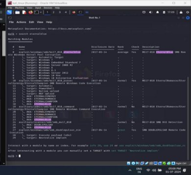
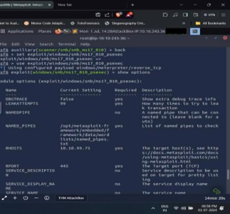
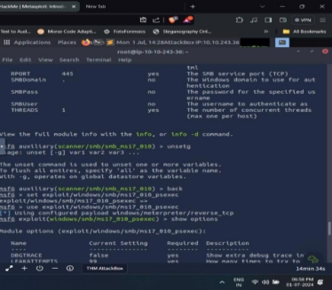
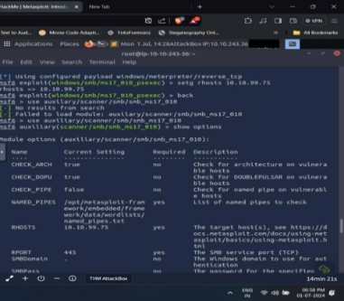

METASPLOIT

Metasploit is the most widely used exploitation                 framework. Metasploit is a powerful tool that can support all phases of a penetration testing engagement, from information gathering to post-exploitation.

COMMANDS USED IN METASPLOIT

- search: Finds exploits, payloads, and modules based on keywords.
- Example: search windows smb
- use: Selects a specific module to load and use.
- Example: use exploit/windows/smb/ms17\_010\_eternalblue
- set: Configures options for the selected module, such as target IP addresses and payloads.
- Example: set RHOSTS 192.168.1.100
- show options: Displays the configurable options for the currently selected module.
- Example: show options
- run or exploit: Executes the configured exploit or auxiliary module.
- Example: exploit
- sessions: Manages multiple sessions, allowing interaction with established sessions.
- Example: sessions -i1
- background: Moves an active session to the background.
- Example: background
- exit: Exits the Metasploit console or terminates a session.
- Example: exit
- help: Displays a list of available commands and their descriptions.
- Example: help
- db\_nmap: Integrates with Nmap for network scanning and imports the results into Metasploit's database.
- Example: db\_nmap -sV192.168.1.0/24

 

 

USES OF METASPLOIT

- Exploit Development: Metasploit allows security professionals to develop and test custom exploits.
- Vulnerability Scanning: It scans systems and networks to identify known vulnerabilities.
- Payload Generation: Metasploit generates various payloads, such as reverse shells, for penetration testing.
- Post-Exploitation: It provides tools for post-exploitation activities like privilege escalation and data extraction.
- Social Engineering: Metasploit includes modules for conducting social engineering attacks to assess human vulnerabilities.
