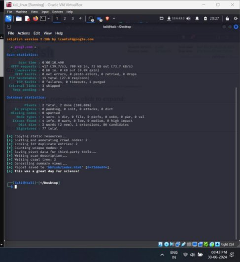
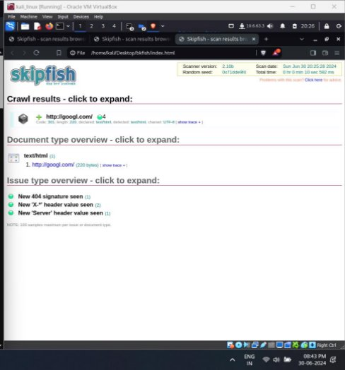

SKIPFISH

skipfish is an active web application security             reconnaissance tool.It prepares an interactive sitemap for     the targeted site by carrying out a recursive crawl and       dictionary-based probes. The resulting map is then         annotated with the output from a number of active (but      hopefully non-disruptive) security checks. The fi‐ nal report generated by the tool is meant to serve as a foundation for professional web application secu‐ rityassessments.

Skipfishperforms recursive crawl and dictionary-based tests over all URLs, using its recon capabilities. The crawl creates a digital map of security checks and their results.

- Noteworthy Skipfishfeatures include:
- Automated learning capabilities.
- Differential security checks.
- Easy to use.
- A low false positive ratio.
- The ability to run high-speed security checks, with over 200 requests per second.

SYNOPSIS =>skipfish[options] -o output-directory [ start- url| @url-file [ start-url2 ... ]

 

USEOFSKIPFISH

- Web Application Scanning: Skipfish scans web applications to identify security vulnerabilities.
- Automated Reconnaissance: It performs automated reconnaissance to gather information about web servers.
- Cross-Site Scripting Detection: Skipfish detects potential cross - site scripting (XSS) vulnerabilities.
- SQL Injection Testing: It identifies SQL injection points within web applications.
- Site Map Generation: Skipfish creates detailed site maps to aid in security assessments and audits.
