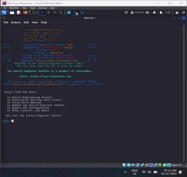
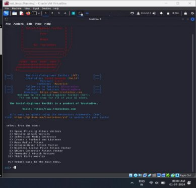
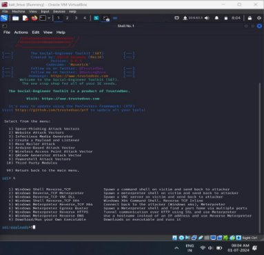
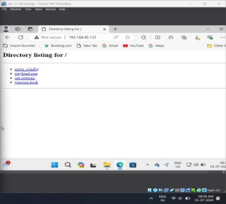
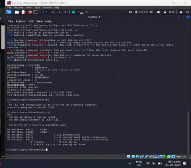

SOCIAL              ENGINEERINGTOOLKIT

The Social-Engineering Toolkit is an open -

source penetration testing framework designed for Social-

Engineering. Set has a number of custom 

attack vectors that allow you to make a belevable attack in 

a fraction of the time

Properities

- Itcontains 
- 1) Social-Engineering Attacks
- 2) Penetration Testing (Fast-Track)
- 3) Third Party Modules 
- 4) Update the Social-Engineer Toolkit 
- 5) Update SET configuration

Windows Meterpreter Reverse\_TCPX64

•It Connect back to the attacker (Windows x64), 

Meterpreter

•Windows Meterpreter Reverse\_TCP x64 is a 

payload used in penetration testing that creates a reverse TCP connection from a compromised Windows x64 system back to the attacker's machine, allowing remote control and command execution through the Meterpreter shell.

`  `

 

USE OF SOCIAL-ENGINEERING TOOL KIT

•Phishing Attacks: SET sends phishing emails to extract sensitive 

data.

- Credential Harvesting: It clones websites to capture user credentials.

•Spear Phishing: SET targets specific individuals or organizations 

with tailored phishing attacks.

•SMiShing and Vishing: It sends spoofed SMS or conducts voice 

phishing to obtain personal information.

•Custom Payloads: SET generates and delivers custom payloads for 

remote access and further exploitation.
