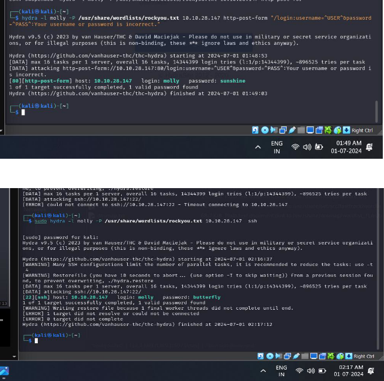
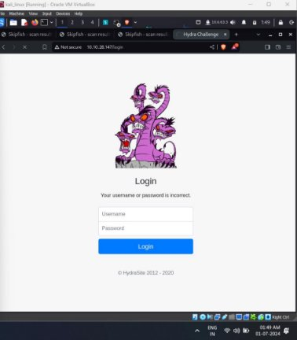

HYDRA

Hydra is a brute force online password cracking program, a quick system login password “hacking” tool.

SOME MOREABOUTHYDRA

Hydra can run through a list and “brute force” some authentication services. Imagine trying to manually guess someone’s password on a particular service (SSH, Web Application Form, FTPor SNMP) - we can use Hydra to run through a password list and speed this process up for us, determining the correct password.

` `

According to https://github.com/vanhauser - thc/thc-hydra

- Hydra supports, i.e., has the ability to brute force the following protocols: “Asterisk, AFP, Cisco AAA, Cisco auth, Cisco enable, 

  CVS, Firebird, FTP, HTTP-FORM-GET, HTTP-FORM-POST, HTTP-

  GET, HTTP-HEAD, HTTP-POST, HTTP-PROXY, HTTPS-FORM-GET, HTTPS-FORM-POST, HTTPS-GET, HTTPS-HEAD, HTTPS-POST, HTTP-Proxy, ICQ, IMAP, IRC, LDAP, MEMCACHED, MONGODB, MS- SQL, MYSQL, NCP, NNTP, Oracle Listener, Oracle SID, Oracle, PC- Anywhere, PCNFS, POP3, POSTGRES, Radmin, RDP, Rexec, 

  Rlogin, Rsh, RTSP, SAP/R3, SIP, SMB,SMTP,SMTPEnum, SNMP v1+v2+v3, SOCKS5,SSH (v1 and v2), SSHKEY, Subversion, TeamSpeak (TS2), Telnet, VMware-Auth, VNC and XMPP.”

  COMMANDSUSEDHYDRA

- Use Hydra to bruteforce USER's SSH password -

hydra -l <username> -P <full path to pass> 10.10.28.147 -t 4 ssh HERE

-l => specifies the  ssh username for login

-P=> indicates a list of passwords

-t =>sets the number of threads to spawn

- We can use hydra to bruteforce web too
- Command= sudo hydra <username> <wordlist> MACHINE\_IP http-post-form "<path>:<login\_credentials>:<invalid\_response>"
**

